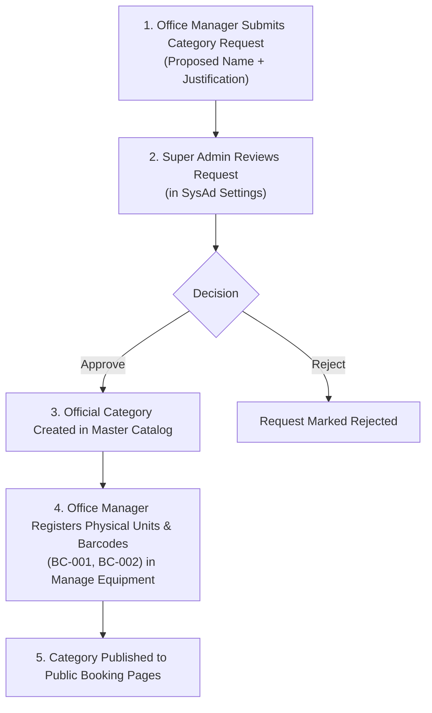
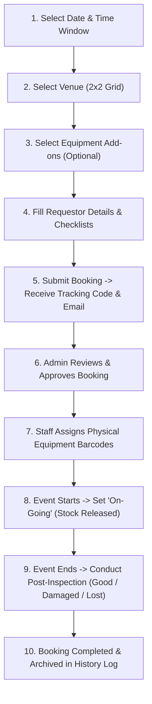

# Father Saturnino Urios University (FSUU)
## Automated Venue Reservation & Equipment Borrowing Management System
### Comprehensive System Documentation

---

## 1. System Overview & Purpose

The **FSUU Automated Venue Reservation & Equipment Borrowing Management System** is an enterprise-grade institutional web platform designed to streamline, automate, and centralize facility scheduling and physical asset management for Father Saturnino Urios University.

### Primary Objectives:
- **Public Convenience**: Enable students, faculty, staff, and external clients to easily book campus venues and borrow institutional equipment online with real-time availability checks.
- **Conflict Prevention**: Eliminate double-booking of venues and over-borrowing of equipment using time-slot collision detection.
- **Asset Accountability**: Track physical equipment down to unique serial barcodes, monitoring equipment condition (*Good*, *Damaged*, *Lost*) through mandatory post-event inspections.
- **Transparency**: Provide automated email and SMS status updates with official tracking codes for instant lookup.
- **Administrative Governance**: Offer role-based dashboards for Staff, Office Managers, and Super Administrators with detailed audit trails and financial fee matrices.

---

## 2. Technology Stack & Architecture

```
+-----------------------------------------------------------------------+
|                           CLIENT LAYER                                |
|  React 18  *  Vite  *  Tailwind CSS  *  Lucide Icons  *  Axios       |
+-----------------------------------------------------------------------+
                                  |
                                  | REST API (JSON / Multipart)
                                  v
+-----------------------------------------------------------------------+
|                          APPLICATION LAYER                            |
|  Laravel 11 (PHP 8.2+)  *  Sanctum Auth  *  Form Requests  * Policies |
+-----------------------------------------------------------------------+
                                  |
                                  | Eloquent ORM
                                  v
+-----------------------------------------------------------------------+
|                           DATABASE LAYER                              |
|  MySQL / MariaDB (Relational Schema, Soft Deletes, Foreign Keys)      |
+-----------------------------------------------------------------------+
```

### Frontend Architecture:
- **Framework**: React 18 with Vite bundling.
- **Routing**: `react-router-dom` with role-based layout guards (`SysadLayout`, `AdminLayout`).
- **Styling**: Tailwind CSS with custom responsive utilities and glassmorphic UI tokens.
- **Icons & UI Utilities**: `lucide-react`, `date-fns`, `sonner` / custom alerts.

### Backend Architecture:
- **Framework**: Laravel 11.
- **Authentication**: Laravel Sanctum (token-based API authentication) and Google OAuth 2.0.
- **Authorization**: Granular Policy classes (`VenueBookingPolicy`, `EquipmentBorrowingPolicy`).
- **Database Abstraction**: Eloquent ORM with soft-delete archiving (`archived_at`).
- **Notifications**: Laravel Mail (`Mailable`) and SMS dispatch hooks.

---

## 3. User Roles & Permission Hierarchy

| Role | Identifiers | Scope & Responsibilities | Portal URL |
| :--- | :--- | :--- | :--- |
| **Public User** | Unauthenticated | Submits venue reservations, files equipment requests, and tracks request status via Reference Code. | `/`, `/book-venue`, `/borrow-equipment`, `/track` |
| **Staff** | `role: staff` | Handles day-to-day front desk operations: scans/assigns unit barcodes, marks requests as *On-Going* (release), and performs post-inspections. | `/admin/*` |
| **Office Manager (Admin)** | `role: admin` | Manages facility operations: reviews & approves/rejects bookings, manages venue catalog, requests new equipment categories, and oversees staff. | `/admin/*` |
| **Super Admin (SysAd)** | `role: super_admin` | Full institutional authority: manages user accounts/invitations, approves equipment categories, configures operating hours, sets fee matrices, and oversees global audit logs. | `/sysad/*` |

---

## 4. End-to-End System Lifecycles & Workflows

### 4.1. Equipment Category Request & Catalog Setup Workflow



1. **Category Request**: An Office Manager submits a proposed equipment category (e.g. *"Wireless Lavalier Mic"*) with a justification.
2. **Super Admin Approval**: Super Admin approves the category in `Sysad Settings → Category Requests`, creating the official `EquipmentType` record.
3. **Physical Barcoding**: Office Managers add physical units under the category in `Manage Equipment`, setting initial condition (*Good*), lifespan, and purchase date.
4. **Public Availability**: The category and its dynamic real-time stock become immediately bookable on the public portal.

---

### 4.2. Public Venue Reservation Workflow



1. **Step 1 (Schedule)**: User selects reservation date, start time, and end time. Real-time collision checking verifies venue availability.
2. **Step 2 (Venue)**: User browses venue cards (capacity, amenities, photos) and chooses a venue.
3. **Step 3 (Equipment)**: User specifies any equipment needed for the venue (e.g., 2 microphones, 1 projector).
4. **Step 4 (Filer Info)**: User enters personal details (`@urios.edu.ph` email, mobile number, department/organization, event purpose).
5. **Submission**: User receives a clean confirmation modal; tracking details are dispatched via email and SMS.

---

### 4.3. Public Equipment Borrowing Workflow

1. **Step 1 (Usage Date & Time)**: Borrower selects usage date and pickup/return times.
2. **Step 2 (Equipment Selection)**: Borrower browses equipment category cards and specifies requested quantities.
3. **Step 3 (Filer Details & Place of Use)**: Borrower inputs contact information, campus place of use, and purpose.
4. **Submission**: Tracking number generated, notification sent, and status set to `PENDING`.

---

### 4.4. Unit Assignment, Release & Inventory Stock Synchronization

```
+---------------------------------------------------------------------------------------+
|                               INVENTORY STOCK TABLE                                   |
|  Total Stock  |  Qty Present (Available)  |  Released  |  Damaged  |  Lost  | Status  |
+---------------------------------------------------------------------------------------+
```

1. **Unit Assignment (`Status: APPROVED`)**:
   - Staff/Admin selects specific operational barcodes from the dropdown (e.g. `BC-MIC-001`, `BC-MIC-002`).
   - Selected units enter a temporary `reserved` hold.
2. **Hand-over / Event Start (`Status: ON-GOING`)**:
   - Staff clicks **"Set On-Going / Release"**.
   - Unit barcodes transition to status `released`.
   - **Stock Count Adjustment**:
     - `Qty Present` decreases by the assigned quantity.
     - `Released` increases by the assigned quantity.
3. **Return & Post-Inspection (`Status: POST-INSPECTION -> COMPLETED`)**:
   - Staff checks each unit condition upon return:
     - **Good**: Unit status returns to `available`, `Qty Present` restored, `Released` decreases to 0. Request marked `COMPLETED`.
     - **Damaged**: Unit status set to `unavailable / Damaged`, category stock updates `Damaged +1`. Photo evidence and violation notes recorded.
     - **Lost**: Unit status set to `unavailable / Lost`, category stock updates `Lost +1`.

---

## 5. Core System Modules & Features

### 5.1. Public Portal
- **Landing Page (`/`)**: Gateway for venue booking, equipment borrowing, and status tracking.
- **Venue Booking Form (`/book-venue`)**: Multi-step wizard with real-time schedule conflict validation.
- **Equipment Borrowing Form (`/borrow-equipment`)**: Multi-step wizard with live stock calculation per time window.
- **Tracking & Status Lookup (`/track`)**: Public tracking portal allowing requestors to view progress, approvals, and claim details using their Reference Code.

### 5.2. Facility & Venue Management (`/admin/manage-venues`)
- Create, update, and soft-delete university venues.
- Configure seating capacities, room amenities, and facility photos.
- Set venue blackout dates and maintenance availability overrides.

### 5.3. Equipment & Inventory Management (`/admin/manage-equipments`)
- Register physical units with unique barcodes, serial numbers, purchase dates, and lifespan years.
- Live inventory stock table showing **Total Stock**, **Qty Present**, **Released**, **Damaged**, and **Lost**.
- Filter equipment by category and search by barcode or unit name.
- Direct barcode copy-to-clipboard functionality.

### 5.4. Booking Management (`/admin/venue-bookings` & `/admin/equipment-borrowings`)
- Comprehensive request list with status tabs (*All, Pending, Approved, On-Going, Completed, Cancelled*).
- Interactive Detail Modal with:
  - Requestor details and purpose.
  - Requested items vs. assigned barcode units.
  - Workflow action buttons (*Approve, Reject, Set On-Going, Complete, Undo, Cancel*).
  - Resend Email confirmation button.
  - Post-Inspection interface with photo evidence upload and condition tags.

### 5.5. Super Admin System Control (`/sysad/settings`)
- **User Management**: Invite staff, assign roles (`staff`, `admin`, `super_admin`), and toggle permissions.
- **Equipment Catalog**: Approve category requests and manage master categories.
- **Venue Catalog**: Manage university-wide facilities and room configurations.
- **Fee Matrix**: Configure rental prices, student discounts, overtime surcharges, and damage penalties.
- **Operating Hours**: Define standard opening/closing hours and minimum lead-time notice.
- **Verification PIN**: Set high-security master PIN for emergency administrative overrides.
- **Campuses & Offices**: Manage campus locations (e.g. *Main Campus*, *Morelos Campus*) and managing offices.

### 5.6. Analytics & Audit Trail (`/admin/reports` & `/admin/history-log`)
- Departmental utilization analytics and frequency charts.
- Permanent history logs of all approvals, cancellations, unit releases, and condition changes.
- Soft-delete recovery and action undo capabilities.

---

## 6. Database Schema & Key Data Models

```
+-------------------+       +-----------------------+       +---------------------+
|      venues       |       |    equipment_types    |       |   equipment_units   |
+-------------------+       +-----------------------+       +---------------------+
| id (PK)           |       | id (PK)               |       | id (PK)             |
| name              |       | eq_name / name        |       | equipment_type_id   |
| capacity          |       | office_id             |       | unit_code (barcode) |
| location          |       | description           |       | status              |
| status            |       | avatar                |       | condition           |
| office_id         |       | is_active             |       | purchased_at        |
+-------------------+       +-----------------------+       | eq_lifespan         |
                                                            +---------------------+
                                                                       |
+-------------------+       +-----------------------+                  |
|  tracking_numbers |       |    venue_bookings     |                  |
+-------------------+       +-----------------------+                  |
| id (PK)           |       | id (PK)               |                  |
| reference_code    |       | tracking_number_id    |                  |
| status            |       | venue_id              |                  |
| type              |       | filer_name            |                  |
| email             |       | email_address         |                  |
| contact_number    |       | date_of_usage         |                  |
+-------------------+       | start_datetime        |                  |
                            | end_datetime          |                  |
                            | assigned_units (JSON) |------------------+
                            | status                |                  |
                            +-----------------------+                  |
                                                                       |
+-------------------+       +-----------------------+                  |
|    inspections    |       |   equipment_borrows   |                  |
+-------------------+       +-----------------------+                  |
| id (PK)           |       | id (PK)               |                  |
| reference_type    |       | tracking_number_id    |                  |
| reference_id      |       | filer_name            |                  |
| condition         |       | date_of_usage         |                  |
| violation_type    |       | time_start / time_end |                  |
| evidence_photo    |       | assigned_units (JSON) |------------------+
| notes             |       | status                |
+-------------------+       +-----------------------+
```

---

## 7. API Route Reference

### Public Routes (`/api/public/*`)
| Method | Endpoint | Description |
| :--- | :--- | :--- |
| `GET` | `/public/venues` | Lists all active venues for public booking |
| `GET` | `/public/equipment-types` | Lists equipment categories with live dynamic stock |
| `GET` | `/public/departments` | Lists academic departments and programs |
| `GET` | `/public/venue-availability` | Checks venue schedule availability |
| `GET` | `/public/operating-hours` | Gets current institutional operating hours |
| `POST` | `/public/avr-venue-bookings` | Submits a new venue reservation request |
| `POST` | `/public/avr-equipment-borrowings` | Submits a new equipment borrowing request |
| `POST` | `/public/track` | Looks up booking status by Reference Code |
| `POST` | `/public/send-otp` | Dispatches OTP verification code |
| `POST` | `/public/verify-otp` | Validates OTP verification code |
| `POST` | `/public/verify-pin` | Verifies administrative override PIN |

### Authenticated Admin & Staff Routes (`/api/*`)
| Method | Endpoint | Description |
| :--- | :--- | :--- |
| `GET` | `/admin/equipment-types` | Master equipment categories list |
| `POST` | `/admin/equipment-types` | Creates a new equipment category |
| `PUT` | `/admin/equipment-types/{id}` | Updates an equipment category |
| `GET` | `/admin/equipment-units` | Lists all physical equipment barcodes |
| `POST` | `/admin/equipment-units` | Registers a new physical unit |
| `PUT` | `/admin/equipment-units/{id}` | Updates physical unit details / condition |
| `DELETE` | `/admin/equipment-units/{id}` | Soft-deletes a physical unit |
| `GET` | `/admin/category-requests` | Lists category proposals from office managers |
| `POST` | `/admin/category-requests/{id}/approve` | Super Admin approves proposed category |
| `GET` | `/admin/venues` | Lists all venues |
| `POST` | `/admin/venues` | Creates a new venue |
| `PUT` | `/admin/venues/{id}` | Updates a venue |
| `GET` | `/avr-venue-bookings` | Lists all venue bookings |
| `POST` | `/avr-venue-bookings/{id}/approve` | Approves a venue booking |
| `POST` | `/avr-venue-bookings/{id}/ongoing` | Sets venue booking to on-going |
| `PUT` | `/avr-venue-bookings/{id}/assign-units` | Assigns physical unit barcodes to booking |
| `POST` | `/avr-venue-bookings/{id}/complete` | Completes booking after inspection |
| `GET` | `/avr-equipment-borrowings` | Lists all equipment borrowings |
| `POST` | `/avr-equipment-borrowings/{id}/approve` | Approves an equipment borrowing |
| `POST` | `/avr-equipment-borrowings/{id}/ongoing` | Releases assigned equipment (*On-Going*) |
| `PUT` | `/avr-equipment-borrowings/{id}/assign-units` | Assigns physical unit barcodes to borrowing |
| `POST` | `/avr-equipment-borrowings/{id}/complete` | Completes borrowing and restores inventory |
| `POST` | `/inspections` | Records post-event inspection report |
| `GET` | `/admin/history-log` | Audit logs and soft-deleted records |
| `GET` | `/admin/fee-matrix` | Lists pricing and penalty rules |
| `PUT` | `/admin/operating-hours` | Updates institutional operating hours |

---

## 8. Installation, Configuration & Deployment

### 8.1. Prerequisites
- **PHP**: `^8.2` with `pdo`, `mbstring`, `openssl`, `curl` extensions.
- **Composer**: `^2.5`.
- **Node.js**: `^18.0` or `^20.0` with `npm`.
- **Database**: MySQL `^8.0` or MariaDB `^10.5`.

### 8.2. Backend Setup
```bash
cd "backend"

# 1. Install dependencies
composer install

# 2. Configure Environment
cp .env.example .env
# Set DB_DATABASE, DB_USERNAME, DB_PASSWORD, and MAIL credentials in .env

# 3. Generate App Key & Migrate Database
php artisan key:generate
php artisan migrate --seed

# 4. Create Storage Symlink
php artisan storage:link

# 5. Start Laravel Development Server
php artisan serve --port=8000
```

### 8.3. Frontend Setup
```bash
cd "frontend"

# 1. Install dependencies
npm install

# 2. Start Development Server
npm run dev

# 3. Build Production Bundle
npm run build
```

---

## 9. Security, Data Protection & Maintenance

1. **Authorization Policies**: All administrative endpoints enforce granular Laravel policies (`VenueBookingPolicy`, `EquipmentBorrowingPolicy`) ensuring unauthorized users cannot approve or cancel requests.
2. **Soft Deletes**: Critical assets (venues, physical units, bookings) utilize `SoftDeletes` (`archived_at` column) to prevent accidental permanent data loss.
3. **Input Sanitization & Validation**: Form Requests validate all incoming payloads, enforcing string trimming, email format rules, and date boundaries.
4. **Rate Limiting**: Public submission and OTP verification endpoints are protected by Laravel's built-in throttle middleware (`throttle:public-submissions`, `throttle:otp`).
5. **Audit Trail Logging**: Every status transition and inspection outcome is logged in the `history_logs` and `inspections` tables with timestamp and actor metadata.

---

*Documentation Version: 2.0.0*  
*Father Saturnino Urios University (FSUU)*  
*Automated Venue Reservation & Equipment Borrowing Management System*
