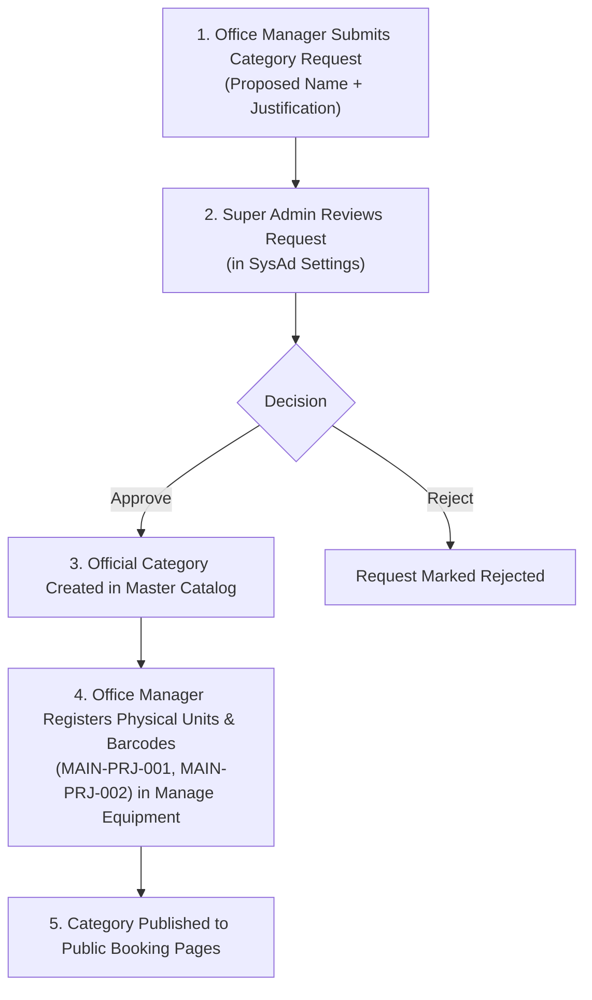
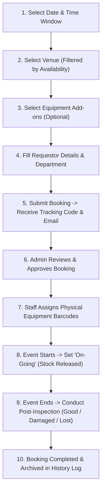
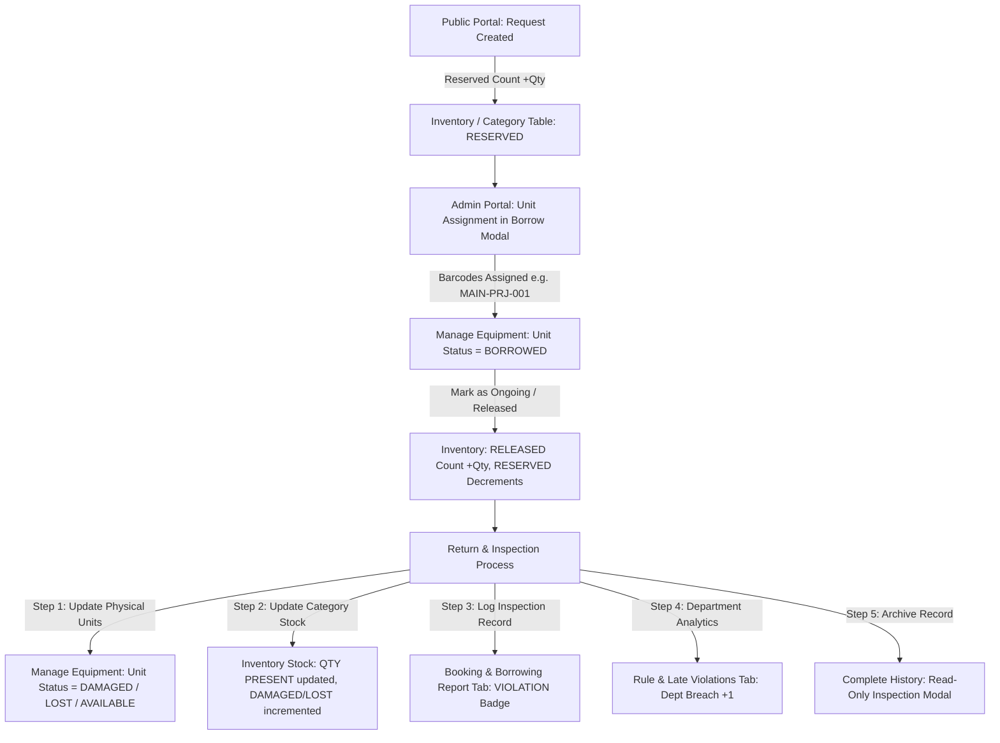

# Father Saturnino Urios University (FSUU)
## Automated Venue Reservation & Equipment Borrowing Management System
# FSUU Facilities & Equipment Reservation System — System Documentation (v2.2.0)

## Overview & Architecture
This platform provides multi-office, role-based reservation management for Father Saturnino Urios University (FSUU). It handles **Venue Bookings** and **Equipment Borrowings** with real-time stock computation, physical unit barcode tracking, department breach analytics, and **instant WebSocket broadcasting via Pusher & Laravel Echo**.

---

## ⚡ Real-Time Broadcasting & WebSocket Infrastructure (Pusher & Laravel Echo)

### 1. Broadcast Channels & Events
| Channel Name | Broadcast Event | Trigger Condition | Frontend Listeners & Actions |
| :--- | :--- | :--- | :--- |
| `admin-notifications` | `booking.created` | Public applicant submits venue booking or equipment borrow request. | Admin header displays pop-up toast notification, sound alert, and increments unread badge. |
| `admin-notifications` | `booking.status_updated` | Staff approves, rejects, cancels, or completes a request. | Admin updates notification lists and refreshes queue metrics. |
| `booking.reference_code` | `booking.status_updated` | Request status transitions (`pending` $\rightarrow$ `approved` $\rightarrow$ `ongoing` $\rightarrow$ `completed`). | Public Tracking page (`/track`) auto-advances the step indicator without manual search. |
| `equipment-inventory` | `inventory.updated` | Units released, returned, or marked damaged/lost during inspection. | Manage Equipment table & Master Category Stock table instantly reload shelf counts. |

### 2. Graceful Offline Fallback
- If `VITE_PUSHER_APP_KEY` is not present in `.env`, the frontend initializes a silent dummy channel provider, ensuring the entire application continues operating normally via standard REST APIs without throwing console errors.

---

## 1. System Overview & Purpose

The **FSUU Automated Venue Reservation & Equipment Borrowing Management System** is an enterprise-grade institutional web platform designed to streamline, automate, and centralize facility scheduling and physical asset management for Father Saturnino Urios University.

### Primary Objectives:
- **Public Convenience**: Enable students, faculty, staff, and external clients to easily book campus venues and borrow institutional equipment online with real-time availability checks.
- **Conflict Prevention**: Eliminate double-booking of venues and over-borrowing of equipment using real-time Gantt timeline matrices and time-slot collision detection.
- **Granular Asset Accountability**: Track physical equipment down to unique serial barcodes (e.g., `MAIN-PRJ-001`), monitoring individual equipment conditions (*Good*, *Damaged*, *Lost*) through mandatory post-event inspections.
- **Multi-Category & Multi-Unit Support**: Seamlessly support borrowing requests containing multiple equipment categories with multiple physical units, tracking each unit's individual inspection outcome.
- **Institutional Department Governance**: Automatically charge and monitor policy breaches, damaged assets, lost items, and overdue returns against the university's 9 academic colleges.
- **Administrative Transparency**: Offer role-based dashboards for Staff, Office Managers, and Super Administrators with detailed audit trails, fee matrices, and historical reports.

---

## 2. Technology Stack & Architecture

```
+-----------------------------------------------------------------------+
|                           CLIENT LAYER                                |
|  React 18  *  Vite  *  Tailwind CSS  *  Lucide Icons  *  Axios       |
+-----------------------------------------------------------------------+
                                  |
                                  | REST API (JSON / Multipart)
                                  v
+-----------------------------------------------------------------------+
|                          APPLICATION LAYER                            |
|  Laravel 11 (PHP 8.2+)  *  Sanctum Auth  *  Form Requests  * Policies |
+-----------------------------------------------------------------------+
                                  |
                                  | Eloquent ORM
                                  v
+-----------------------------------------------------------------------+
|                           DATABASE LAYER                              |
|  MySQL / MariaDB / SQLite (Relational Schema, Soft Deletes, FKs)      |
+-----------------------------------------------------------------------+
```

### Frontend Architecture:
- **Framework**: React 18 with Vite bundling.
- **Routing**: `react-router-dom` with role-based layout guards (`SysadLayout`, `AdminLayout`).
- **Styling**: Tailwind CSS with custom responsive utilities, plain minimalist cards, and modern UI tokens.
- **Icons & UI Utilities**: `lucide-react`, `date-fns`, `sonner` notifications.

### Backend Architecture:
- **Framework**: Laravel 11.
- **Authentication**: Laravel Sanctum (token-based API authentication) and Google OAuth 2.0.
- **Authorization**: Granular Policy classes (`VenueBookingPolicy`, `EquipmentBorrowingPolicy`).
- **Database Abstraction**: Eloquent ORM with soft-delete archiving (`archived_at`).
- **Analytics & History**: `HistoryLogService`, `DepartmentAnalyticsController`, and `InspectionService`.

---

## 3. Academic Structure (FSUU Colleges)

The system is seeded and configured to support the 9 official colleges of Father Saturnino Urios University:

1. **College of Information, Technology, Entertainment, and Computing (CITEC)**
2. **College of Criminal Justice Education (CCJE)**
3. **College of Teacher Education (CTE)**
4. **College of Accountancy (CoA)**
5. **College of Nursing (CoN)**
6. **College of Arts and Sciences (CAS)**
7. **College of Operations, Resources, and Entrepreneurship (CORE)**
8. **College of Engineering and Technology (CEnTech)**
9. **College of Innovative Hospitality and Tourism (CIHT)**

---

## 4. User Roles & Permission Hierarchy

| Role | Identifiers | Scope & Responsibilities | Portal URL |
| :--- | :--- | :--- | :--- |
| **Public User** | Unauthenticated | Submits venue reservations, files equipment requests, and tracks request status via Reference Code. | `/`, `/book-venue`, `/borrow-equipment`, `/track` |
| **Staff** | `role: staff` | Handles day-to-day front desk operations: scans/assigns unit barcodes, marks requests as *On-Going* (release), and performs post-inspections. | `/admin/*` |
| **Office Manager (Admin)** | `role: admin` | Manages facility operations: reviews & approves/rejects bookings, manages venue catalog, requests new equipment categories, and oversees staff. | `/admin/*` |
| **Super Admin (SysAd)** | `role: super_admin` | Full institutional authority: manages user accounts/invitations, approves equipment categories, configures operating hours, sets fee matrices, and oversees global audit logs. | `/sysad/*` |

---

## 5. End-to-End System Lifecycles & Workflows

### 5.1. Equipment Category Request & Catalog Setup Workflow



1. **Category Request**: An Office Manager submits a proposed equipment category (e.g., *"Wireless Lapel & Handheld Microphone Set"*) with a justification.
2. **Super Admin Approval**: Super Admin approves the category in `Sysad Settings → Category Requests`, creating the official `EquipmentType` record.
3. **Physical Barcoding**: Office Managers add physical units under the category in `Manage Equipment`, setting initial condition (*Good*), lifespan, and purchase date.
4. **Public Availability**: The category and its dynamic real-time stock become immediately bookable on the public portal.

---

### 5.2. Public Venue Reservation Workflow



---

### 5.3. Public Equipment Borrowing Workflow

1. **Step 1 (Usage Date & Time)**: Borrower selects usage date and pickup/return times.
2. **Step 2 (Equipment Selection)**: Borrower browses equipment category cards and specifies requested quantities. The available counter live-decrements as the user increments selection quantity:
   $$\text{Remaining Available} = \max(0, \text{Total Available} - \text{Selected Quantity})$$
3. **Step 3 (Filer Details & Place of Use)**: Borrower inputs contact information, college/program, campus place of use, and purpose.
4. **Submission**: Tracking number generated, notification sent, and status set to `PENDING`.

---

### 5.4. Unit Assignment, Release & Multi-Tab Synchronization

```
+---------------------------------------------------------------------------------------------------+
|                                 INVENTORY STOCK & MASTER TABLE                                    |
|  ITEM NO. | CATEGORY | TOTAL STOCK | QTY PRESENT | RESERVED | RELEASED | DAMAGED | LOST | NOTES |
+---------------------------------------------------------------------------------------------------+
```



1. **Unit Assignment (`Status: APPROVED`)**:
   - Staff/Admin selects specific operational barcodes from the dropdown (e.g., `MAIN-PRJ-001`, `MAIN-PRJ-002`).
   - Category inventory displays quantity in the `RESERVED` column, protecting units from double-allocation.
2. **Hand-over / Event Start (`Status: ON-GOING`)**:
   - Staff clicks **"Set On-Going / Release"**.
   - Unit barcodes transition to status `released` / `borrowed`.
   - **Stock Count Adjustment**:
     - `RESERVED` decrements to 0.
     - `RELEASED` increases by assigned quantity.
3. **Return & Post-Inspection (`Status: COMPLETED`)**:
   - Staff inspects each unit independently:
     - **Good**: Unit status returns to `available`, condition `Good`. `QTY PRESENT` restored.
     - **Damaged**: Unit status set to `damaged`, condition `Damaged`. Category stock increments `DAMAGED +1`, `QTY PRESENT` decremented.
     - **Lost**: Unit status set to `lost`, condition `Lost`. Category stock increments `LOST +1`.
   - **Timeliness Check**: Staff records if returned *On Time* or *Late Return* (with minutes overdue).

---

### 5.5. Multi-Category & Multi-Unit Inspection Tracking

When a single borrowing contains **multiple categories** (e.g., Projector, Microphone, Cable) and **multiple units per category**, the system records every unit individually:

```json
{
  "inspectable_type": "App\\Models\\EquipmentBorrow",
  "assigned_units": ["MAIN-PRJ-004", "MAIN-PRJ-005", "MAIN-MIC-002", "MAIN-MIC-003", "MAIN-CBL-002", "MAIN-CBL-003"],
  "unit_conditions": {
    "MAIN-PRJ-004": "Good",
    "MAIN-PRJ-005": "Damaged",
    "MAIN-MIC-002": "Good",
    "MAIN-MIC-003": "Lost",
    "MAIN-CBL-002": "Good",
    "MAIN-CBL-003": "Good"
  },
  "violation_type": "Mixed Units Damage & Loss",
  "notes": "Projector MAIN-PRJ-005 lamp failure; Mic MAIN-MIC-003 clip declared lost."
}
```

- Each physical barcode is updated in `equipment_units` table without cross-contamination.
- In the **History Log Modal**, each unit renders its exact condition badge (`GOOD`, `DAMAGED`, `LOST`).

---

## 6. Core System Modules & Features

### 6.1. Public Portal
- **Landing Page (`/`)**: Gateway for venue booking, equipment borrowing, and status tracking.
- **Venue Booking Form (`/book-venue`)**: Multi-step wizard with real-time schedule conflict validation.
- **Equipment Borrowing Form (`/borrow-equipment`)**: Multi-step wizard with live stock calculation per time window.
- **Tracking & Status Lookup (`/track`)**: Public tracking portal allowing requestors to view progress, approvals, and claim details using their Reference Code.

### 6.2. Facility & Venue Management (`/admin/manage-venues`)
- Create, update, and soft-delete university venues.
- Configure seating capacities, room amenities, and facility photos.
- 12-column responsive layout (7-col calendar, 5-col form) with plain minimalist cards.
- Isolated venue availability overrides strictly keyed by `${venueId}_${date}` to prevent cross-venue schedule leakage.
- Gantt Timeline Matrix calibrated strictly to operating hours (7:00 AM – 7:00 PM).

### 6.3. Equipment & Inventory Management (`/admin/manage-equipments`)
- Register physical units with unique barcodes, serial numbers, purchase dates, and lifespan years.
- Live inventory stock table showing **Item No.**, **Category**, **Total Stock**, **Qty Present**, **Reserved**, **Released**, **Damaged**, and **Lost**.
- Ellipsis text truncation with full hover tooltips.
- Direct barcode copy-to-clipboard functionality.

### 6.4. Reports & Departmental Analytics (`/admin/reports`)
- **Booking & Borrowing Reports Tab**: Comprehensive table showing all historical bookings and borrowings with `CLEAN` or `VIOLATION` outcome tags.
- **Rule & Late Violations Tab (`BreachesTab`)**: Real-time analytics breakdown tracking departmental violations across 4 categories:
  1. *Venue Violations & Facility Damage*
  2. *Late Equipment Returns (with delay duration)*
  3. *Equipment Damage*
  4. *Equipment Lost*
- **Equipment Stock Tab**: Live synchronization of physical units with master categories.

### 6.5. Super Admin System Control (`/sysad/settings`)
- **User Management**: Invite staff, assign roles (`staff`, `admin`, `super_admin`), and toggle permissions.
- **Equipment Catalog**: Approve category requests and manage master categories.
- **Venue Catalog**: Manage university-wide facilities and room configurations.
- **Fee Matrix**: Configure rental prices, student discounts, overtime surcharges, and damage penalties.
- **Operating Hours**: Define standard opening/closing hours and minimum lead-time notice.
- **Verification PIN**: Set high-security master PIN for emergency administrative overrides.
- **Departments & Colleges**: Manage university academic departments.

---

## 7. Database Schema & Key Data Models

```
+-------------------+       +-----------------------+       +---------------------+
|      venues       |       |    equipment_types    |       |   equipment_units   |
+-------------------+       +-----------------------+       +---------------------+
| id (PK)           |       | id (PK)               |       | id (PK)             |
| name              |       | eq_name               |       | equipment_type_id   |
| capacity          |       | office_id             |       | unit_code (barcode) |
| location          |       | description           |       | status              |
| status            |       | avatar                |       | condition           |
| office_id         |       | is_active             |       | purchased_at        |
+-------------------+       +-----------------------+       | eq_lifespan         |
                                                            +---------------------+
                                                                       |
+-------------------+       +-----------------------+                  |
|  tracking_numbers |       |    venue_bookings     |                  |
+-------------------+       +-----------------------+                  |
| id (PK)           |       | id (PK)               |                  |
| reference_code    |       | tracking_number_id    |                  |
| status            |       | venue_id              |                  |
| reservation_type  |       | filer_name            |                  |
| reservation_id    |       | email_address         |                  |
| approved_by       |       | program_office (dept) |                  |
+-------------------+       | date_of_usage         |                  |
                            | time_start / time_end |                  |
                            | assigned_units (JSON) |------------------+
                            +-----------------------+                  |
                                                                       |
+-------------------+       +-----------------------+                  |
|    inspections    |       |   equipment_borrows   |                  |
+-------------------+       +-----------------------+                  |
| id (PK)           |       | id (PK)               |                  |
| inspectable_type  |       | tracking_number_id    |                  |
| inspectable_id    |       | filer_name            |                  |
| condition         |       | program_office (dept) |                  |
| is_late (boolean) |       | date_of_usage         |                  |
| minutes_late      |       | time_start / time_end |                  |
| violation_type    |       | assigned_units (JSON) |------------------+
| unit_conditions   |       +-----------------------+
| notes             |
+-------------------+
```

---

## 8. API Route Reference

### Public Routes (`/api/public/*`)
| Method | Endpoint | Description |
| :--- | :--- | :--- |
| `GET` | `/public/venues` | Lists all active venues for public booking |
| `GET` | `/public/equipment-types` | Lists equipment categories with live dynamic stock |
| `GET` | `/public/departments` | Lists academic departments and colleges |
| `GET` | `/public/venue-availability` | Checks venue schedule availability |
| `GET` | `/public/operating-hours` | Gets current institutional operating hours |
| `POST` | `/public/avr-venue-bookings` | Submits a new venue reservation request |
| `POST` | `/public/avr-equipment-borrowings` | Submits a new equipment borrowing request |
| `POST` | `/public/track` | Looks up booking status by Reference Code |

### Authenticated Admin & Staff Routes (`/api/*`)
| Method | Endpoint | Description |
| :--- | :--- | :--- |
| `GET` | `/admin/equipment-types` | Master equipment categories list |
| `POST` | `/admin/equipment-types` | Creates a new equipment category |
| `GET` | `/admin/equipment-units` | Lists all physical equipment barcodes and status |
| `POST` | `/admin/equipment-units` | Registers a new physical unit |
| `PUT` | `/admin/equipment-units/{id}` | Updates physical unit details / condition |
| `GET` | `/admin/history-log` | Returns completed bookings with inspection reports |
| `POST` | `/admin/history-log/undo` | Reverts completed booking back to on-going |
| `GET` | `/admin/department-analytics` | Department rule violations and late return analytics |
| `POST` | `/admin/equipment-borrowings/{id}/return-inspect` | Submits post-return inspection with unit condition map |

---

## 9. Security, Data Protection & Maintenance

1. **Authorization Policies**: All administrative endpoints enforce granular Laravel policies ensuring unauthorized users cannot approve or cancel requests.
2. **Soft Deletes**: Critical assets (venues, physical units, bookings) utilize `SoftDeletes` (`archived_at` column) to prevent accidental permanent data loss.
3. **Input Sanitization & Validation**: Form Requests validate all incoming payloads, enforcing string trimming, email format rules, and date boundaries.
4. **Audit Trail Logging**: Every status transition and inspection outcome is logged in the `history_logs` and `inspections` tables with timestamp and actor metadata.

---

*Documentation Version: 2.1.0*  
*Father Saturnino Urios University (FSUU)*  
*Automated Venue Reservation & Equipment Borrowing Management System*
