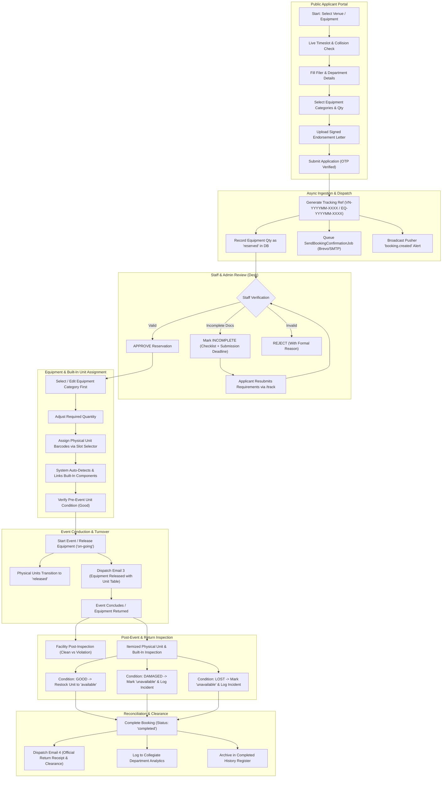

# Father Saturnino Urios University (FSUU)
## Automated Venue Reservation & Equipment Borrowing Management System
# System Documentation (v2.7.2)

## Overview & Architecture
This platform provides multi-office, role-based reservation management for Father Saturnino Urios University (FSUU). It handles **Venue Bookings** and **Equipment Borrowings** with real-time dynamic timeslot stock computation, physical unit barcode tracking, child built-in unit bundling, department breach analytics, strict schedule collision prevention, transactional email dispatch via Brevo/SMTP with official tracking numbers, Google OAuth role-permission parity, single vs. multi-day date range formatting, and role-based incident alerting.

---

## ⚡ Real-Time Broadcasting & WebSocket Infrastructure (Pusher & Laravel Echo)

### 1. Broadcast Channels & Events
| Channel Name | Broadcast Event | Trigger Condition | Frontend Listeners & Actions |
| :--- | :--- | :--- | :--- |
| `admin-notifications` | `booking.created` | Public applicant submits venue booking or equipment borrow request. | Admin header displays pop-up toast notification, sound alert, and increments unread badge. |
| `admin-notifications` | `booking.status_updated` | Staff approves, rejects, cancels, or completes a request — including each venue booking automatically rejected by SPEC RULE 4 (see §2.6) when a competing slot is approved first. | Admin updates notification lists, refreshes queue metrics, and live-updates the "Tasks" badge / "Pending Actions" dropdown without a page reload. |
| `booking.{reference_code}` | `booking.status_updated` | Request status transitions (`pending` $\rightarrow$ `approved` $\rightarrow$ `on-going` $\rightarrow$ `completed`), or `pending` $\rightarrow$ `rejected` (manual or automatic). | Public Tracking page (`/track`) auto-advances the step indicator without manual search, or renders the rejected state immediately. |
| `equipment-inventory` | `inventory.updated` | Units released, returned, or marked damaged/lost during inspection. | Manage Equipment table & Master Category Stock table instantly reload shelf counts. |

### 2. Graceful Offline Fallback
- If `VITE_PUSHER_APP_KEY` is not present in `.env`, the frontend initializes a silent dummy channel provider, ensuring the entire application continues operating normally via standard REST APIs without throwing console errors (`frontend/src/lib/echo.js`).

---

## 1. System Overview & Core Objectives

The **FSUU Automated Venue Reservation & Equipment Borrowing Management System** is an enterprise-grade institutional web platform designed to streamline, automate, and centralize facility scheduling and physical asset management for Father Saturnino Urios University.

### Primary Objectives:
- **Public Convenience**: Enable students, faculty, staff, and external clients to easily book campus venues and borrow institutional equipment online with real-time availability checks.
- **Strict Collision & Double-Booking Prevention**: Prohibit overlapping bookings on the same venue, date, and timeslot. Prevent users from advancing to detail entry if a conflict is detected via `VenueBookingService::checkCollision()`.
- **Atomic Reference Code Generation**: Mint strictly formatted, collision-proof reference codes (`VN-YYYYMM-XXXX` for venues, `EQ-YYYYMM-XXXX` for equipment, `ST-YYYYMM-XXXX` for staff internal) backed by database sequence locks (`ReferenceCodeService`).
- **Strict Email Delivery Pipeline**: Automatically dispatch rich HTML receipts containing the official Tracking Reference Code, venue details, scheduled dates/times, equipment units, and direct status lookup links.
- **Document & Endorsement Verification**: Seamlessly upload and preview signed endorsement letters (PDF/PNG/JPG) with Cloudinary cloud storage and direct admin lightbox verification (`EvidenceLightboxModal`).
- **Dynamic Equipment Lifecycle & Inventory Triggers**:
  - Automatically moves requested equipment counts into **`reserved`** upon booking submission.
  - Automatically transitions assigned physical units to **`released`** upon counter turnover.
  - Dynamically processes post-event inspections:
    - **`Good`**: Restores unit to **`available`** status and **`Good`** condition, immediately restocking available inventory.
    - **`Damaged`**: Updates unit to **`unavailable`** status and **`Damaged`** condition, logging into the damaged asset register.
    - **`Lost`**: Updates unit to **`unavailable`** status and **`Lost`** condition, logging into the lost asset register.
- **Multi-Category & Physical Unit Barcode Assignment**: Support borrowing requests containing multiple equipment categories with multiple physical units, displaying child built-in accessories (e.g. HDMI cables, remotes, power cords) linked to master assets.
- **Institutional Department Governance**: Automatically charge and monitor policy breaches, damaged assets, lost items, and overdue returns against the university's 9 academic colleges.
- **Role-Based Incident Notification System**:
  - Tabbed **Inbox / Archive** notification dropdown with "Archive All" support.
  - **Super Admin**: Receives alerts for Damaged Units, Lost Units, and Policy Violations across all campuses; clicking opens the **Incident Detail Modal** displaying borrower details, unit barcodes, and inspection notes.
  - **Admin & Staff**: Receives office-scoped Venue Bookings, Equipment Borrowings, and Incidents; clicking redirects directly to the booking record or opens the Incident Detail Modal.

---

## 2. Technology Stack, Configuration & Deployment

```
+-----------------------------------------------------------------------+
|                           CLIENT LAYER                                |
|  React 18  *  Vite  *  Tailwind CSS  *  Lucide Icons  *  Axios       |
+-----------------------------------------------------------------------+
                                  |
                                  | REST API (JSON / Multipart Form-Data)
                                  v
+-----------------------------------------------------------------------+
|                          APPLICATION LAYER                            |
|  Laravel 11 (PHP 8.2+)  *  Sanctum Auth  *  Form Requests  * Policies |
+-----------------------------------------------------------------------+
                                  |
                                  | Eloquent ORM / Query Builder
                                  v
+-----------------------------------------------------------------------+
|                           DATABASE LAYER                              |
|  MySQL / MariaDB / TiDB (Relational Schema, Soft Deletes, Row Locks)  |
+-----------------------------------------------------------------------+
```

### 2.1. Frontend Architecture
- **Framework**: React 18 with Vite bundling (`frontend/src/App.jsx`).
- **Routing**: `react-router-dom` with role-based layout guards (`SysadLayout`, `AdminLayout`).
- **Styling**: Tailwind CSS with custom responsive utilities, plain minimalist cards, and flat UI tokens.
- **State & Caching**: React Context API (`AuthContext`, `ThemeContext`) and client-side memory cache with tag invalidation (`lib/apiCache.js`).
- **Notification Dropdown**: Tabbed **Inbox / Archive** component (`NotificationDropdown.jsx`) with live badge counts and hover archiving.

### 2.2. Backend Architecture
- **Framework**: Laravel 11 running on PHP 8.2+.
- **Authentication**: Laravel Sanctum (token-based API authentication) and Google OAuth 2.0 institutional login (`@urios.edu.ph`).
- **Authorization**: Granular Policy classes (`VenueBookingPolicy`, `EquipmentBorrowingPolicy`, `UserPolicy`).
- **Cloud Media Storage**: Cloudinary integration (`MediaUploadService`) with fallback to local public disk.
- **Mail Pipeline**: Queueable Mails (`BookingConfirmationMail`, `BookingStatusUpdateMail`) with database-backed SMTP configuration (`SystemSetting::configureMailer()`).
- **Analytics & History**: `HistoryLogService`, `DepartmentAnalyticsController`, and `InspectionService`.

### 2.3. Environment Configuration & Queue Requirements
The transactional mail system requires the following environment variables in `backend/.env`:

```env
# Mail Transport Configuration
MAIL_MAILER=smtp
MAIL_HOST=smtp-relay.brevo.com
MAIL_PORT=587
MAIL_USERNAME=b59e96001@smtp-brevo.com
MAIL_PASSWORD=your_smtp_key_here
MAIL_ENCRYPTION=tls
MAIL_FROM_ADDRESS=support.booking@fsuu.edu.ph
MAIL_FROM_NAME="Father Saturnino Urios University"

# Optional API Transports (Supported by SystemSetting::configureMailer)
# BREVO_API_KEY=xkeysib-...
# RESEND_API_KEY=re_...

# Queue Connection
# Local Development: sync (executes inline)
# Production: database (requires background queue worker)
QUEUE_CONNECTION=sync
```

> [!IMPORTANT]
> **Queue Worker in Production**: When `QUEUE_CONNECTION=database` is configured, asynchronous background email delivery requires a running queue worker:
> ```bash
> php artisan queue:work --tries=3 --timeout=30 --backoff=30,60,120
> ```

### 2.4. Safe Mail Testing Without Sending Real Emails
In `backend/app/Models/SystemSetting.php` (lines 150–154), the `configureMailer()` method explicitly inspects the environment:
```php
if (in_array($configuredMailer, ['log', 'array'])) {
    Config::set('mail.default', $configuredMailer);
    return;
}
```
- **Guaranteed No-Override Behavior**: If `MAIL_MAILER=log` (or `array`) is specified in `.env`, `SystemSetting::configureMailer()` returns immediately. It **does NOT** override the configuration with database SMTP credentials, preventing socket connection attempts and ensuring zero real emails are transmitted.
- **Safe Testing Workflow**:
  1. Set `MAIL_MAILER=log` in `backend/.env`.
  2. Perform booking submissions, counter releases, or return audits.
  3. Inspect rendered email subjects, headers, and HTML output safely in `backend/storage/logs/laravel.log`.

### 2.5. Deployment Warnings & Operational Caveats
Review the following production deployment characteristics in `backend/docker/entrypoint.sh`:

> [!CAUTION]
> 1. **Silent Migration Failure Masking (`migrate --force || true`)**:  
>    Line 30 of `entrypoint.sh` executes `php artisan migrate --force || true`. Appending `|| true` suppresses migration errors. If a migration encounters a schema collision, syntax error, or foreign key constraint violation, the container will continue starting instead of halting. **Production Risk:** Application code may run against a stale or broken database schema without throwing container boot errors.
> 
> 2. **Missing Production Queue Worker**:  
>    `entrypoint.sh` concludes with `exec php artisan serve --host=0.0.0.0 --port="${PORT:-8000}" --no-reload`. The `exec` call replaces the shell process entirely. **Production Risk:** No background worker (`php artisan queue:work`) is launched. If `QUEUE_CONNECTION=database` is enabled in production on Render/Docker, emails and background jobs will accumulate in the `jobs` database table and **will never be dispatched** unless a separate background worker service is deployed.
> 
> 3. **Single-Threaded Development Server Used in Production (`artisan serve`)**:  
>    `entrypoint.sh` runs `php artisan serve`. The built-in PHP CLI development server is single-threaded, lacks process process-recycling/pooling, and is not designed for concurrent multi-user production traffic. **Production Recommendation:** Standardize on Nginx with PHP-FPM or FrankenPHP/Octane for high concurrency and connection persistence.

### 2.6. Venue Booking Approval: Auto-Rejection of Competing Requests ("SPEC RULE 4")

When a staff member approves a pending venue booking, `VenueBookingService::approve()` automatically rejects every OTHER `pending`/`incomplete` booking for the **same venue** whose date range and time range overlap the just-approved slot. This happens atomically in the same database transaction as the approval — if the approval fails (e.g. a genuine overlap exception), no auto-rejections are committed either.

- **Conflict definition**: same `venue_id`, overlapping `date_of_usage`/`reservation_end_date` range, AND overlapping `time_start`/`time_end` range. Bookings for the same venue on a non-overlapping time slot are left untouched.
- **Concurrency safety**: `approve()` takes a `lockForUpdate()` lock on the `Venue` row before checking for conflicts, preventing two staff members from concurrently approving two mutually conflicting bookings for the same venue/slot (only the first approval to acquire the lock succeeds; the second sees the now-approved slot and throws `VenueOverlapException`).
- **Rejection reason**: each auto-rejected booking's `rejection_reason` reads *"This reservation was automatically rejected because another request for {Venue Name} on this date and time ({start} - {end}) was approved first (Ref: {winning reference code}). Please submit a new reservation for a different venue or schedule."* The same wording is used in the applicant's rejection email and on the public Tracking page.
- **Distinguishing marker**: `venue_bookings.is_auto_rejected` (boolean) and `venue_bookings.auto_reject_winning_reference` (the winning booking's reference code) are set on auto-rejected rows, so staff can tell an automatic rejection apart from a manual one. The History Log displays these as **"Rejected (automatic)"** with the conflicting booking's reference code. The audit log action for this case is `VENUE_BOOKING_AUTO_REJECTED` (vs. `VENUE_BOOKING_REJECTED` for a manual staff rejection).
- **Notifications**: each auto-rejected applicant receives exactly one `BookingStatusUpdateMail` (dispatched once, after the transaction commits) and one `BookingStatusUpdated` broadcast event — both are deferred until after commit so a rollback never leaves a "sent" notification for a change that didn't actually happen.
- **Not restored automatically**: if the winning (approved) booking is later cancelled or undone, auto-rejected competing bookings are **not** automatically restored — a staff member must manually resolve this if the slot becomes available again.

### 2.7. "Pending Actions" Count — Single Source of Truth

The header "Tasks" badge, its "Pending Actions" dropdown, and the Venue Bookings list page's own pending filter now all derive from the same `VenueBooking::pendingReview()` Eloquent scope (`backend/app/Models/VenueBooking.php`), queried fresh on every request (no caching). The frontend Tasks indicator (`PendingTasksIndicator.jsx`) also listens for the `venue_bookings_updated` / `booking_status_updated` / `equipment_borrowings_updated` window events and `fsuu_booking_status_updated_ping` storage events dispatched after every approve/reject/auto-reject/cancel/undo action, so the badge updates live without requiring a page reload.

---

## 3. End-to-End System Flow & Architecture Diagrams

### 3.1. Master System Lifecycle Diagram

```mermaid
flowchart TD
    subgraph PUBLIC["Public Applicant Portal"]
        A["Start: Select Venue / Equipment"] --> B["Live Timeslot & Collision Check"]
        B --> C["Fill Filer & Department Details"]
        C --> D["Select Equipment Categories & Qty"]
        D --> E["Upload Signed Endorsement Letter"]
        E --> F["Submit Application (OTP Verified)"]
    end

    subgraph SYSTEM_SUBMIT["Async Ingestion & Dispatch"]
        F --> G["Generate Tracking Ref (VN-YYYYMM-XXXX / EQ-YYYYMM-XXXX)"]
        G --> H["Record Equipment Qty as 'reserved' in DB"]
        G --> I["Queue SendBookingConfirmationJob (Brevo/SMTP)"]
        G --> J["Broadcast Pusher 'booking.created' Alert"]
    end

    subgraph ADMIN_REVIEW["Staff & Admin Review (Desk)"]
        H --> K{"Staff Verification"}
        K -->|"Incomplete Docs"| L["Mark INCOMPLETE (Checklist + Submission Deadline)"]
        L --> M["Applicant Resubmits Requirements via /track"]
        M --> K
        K -->|"Valid"| N["APPROVE Reservation"]
        K -->|"Invalid"| O["REJECT (With Formal Reason)"]
    end

    subgraph UNIT_ASSIGN["Equipment & Built-In Unit Assignment"]
        N --> P["Select / Edit Equipment Category First"]
        P --> Q["Adjust Required Quantity"]
        Q --> R["Assign Physical Unit Barcodes via Slot Selector"]
        R --> S["System Auto-Detects & Links Built-In Components"]
        S --> T["Verify Pre-Event Unit Condition (Good)"]
    end

    subgraph EVENT_LIFECYCLE["Event Conduction & Turnover"]
        T --> U["Start Event / Release Equipment ('on-going')"]
        U --> V["Physical Units Transition to 'released'"]
        U --> W["Dispatch Email 3 (Equipment Released with Unit Table)"]
        W --> X["Event Concludes / Equipment Returned"]
    end

    subgraph INSPECTION["Post-Event & Return Inspection"]
        X --> Y["Facility Post-Inspection (Clean vs Violation)"]
        X --> Z["Itemized Physical Unit & Built-In Inspection"]
        Z --> Z1["Condition: GOOD -> Restock Unit to 'available'"]
        Z --> Z2["Condition: DAMAGED -> Mark 'unavailable' & Log Incident"]
        Z --> Z3["Condition: LOST -> Mark 'unavailable' & Log Incident"]
    end

    subgraph FINALIZATION["Reconciliation & Clearance"]
        Z1 --> AA["Complete Booking (Status: 'completed')"]
        Z2 --> AA
        Z3 --> AA
        AA --> AB["Dispatch Email 4 (Official Return Receipt & Clearance)"]
        AA --> AC["Log to Collegiate Department Analytics"]
        AA --> AD["Archive in Completed History Register"]
    end
```

---

## 4. Automated Email Notifications & Four-Email Lifecycle

The platform executes a unified transactional email architecture orchestrated by [BookingConfirmationMail.php](file:///c:/Booking%20system/backend/app/Mail/BookingConfirmationMail.php) and [BookingStatusUpdateMail.php](file:///c:/Booking%20system/backend/app/Mail/BookingStatusUpdateMail.php).

### 4.1. Email Dispatch Specification Table

| Email Type | Trigger Condition | Recipient | Key Contents & Template | Job / Mailable | Communication Log Entry |
| :--- | :--- | :--- | :--- | :--- | :--- |
| **1. Venue Booking Submitted** | Public applicant files venue booking (`POST /api/public/avr-venue-bookings`) | Filer Email (`requestor_email`) | Reference Code (`VN-YYYYMM-XXXX`), Venue Name, Location, Schedule (`MM/DD/YYYY \| HH:MM AM TO HH:MM PM`), Purpose, Attendees, Equipment requested, 15-min arrival advisory, Tracking URL. **Closing:** *"We will notify you again once your venue booking is approved."* | `SendBookingConfirmationJob` / `BookingConfirmationMail` | `communication_logs` category: `venue_confirmation` |
| **2. Equipment Borrow Submitted** | Public applicant files equipment borrow (`POST /api/public/avr-equipment-borrowings`) | Borrower Email (`email_address`) | Reference Code (`EQ-YYYYMM-XXXX`), Borrower Name, Equipment items/quantities, Schedule, 15-min counter pickup advisory with physical School ID requirement, Tracking URL. **Closing:** *"We will notify you again once your equipment request is approved."* | `SendBookingConfirmationJob` / `BookingConfirmationMail` (also sends SMS via `SmsService`) | `communication_logs` category: `equipment_confirmation` |
| **3. Equipment Released (On-Going)** | Custodian releases gear at counter (`POST /api/avr-equipment-borrowings/{id}/ongoing`) | Borrower Email (`email_address`) | Reference Code (`EQ-YYYYMM-XXXX`), **Itemized Released Units Table** (`#`, `Serial / Barcode`, `Model`, `Brand`), Return Deadline advisory box. **Closing:** *"Please return the equipment on time to avoid a violation record."* <br>*(Note: Applies strictly to Standalone Equipment Loans; for Venue Bookings, see implementation notes below).* | `SendBookingStatusUpdateJob` / `BookingStatusUpdateMail` (status: `on-going`) | `communication_logs` category: `status_update` |
| **4. Equipment Return Receipt & Clearance** | Custodian completes return inspection (`POST /api/avr-equipment-borrowings/{id}/complete`) | Borrower Email (`email_address`) | Reference Code (`EQ-YYYYMM-XXXX`), **Borrower Name** (explicitly resolved from `$first_name`, `$middle_name`, `$last_name` via `EquipmentBorrow::getFilerNameAttribute()`), Returned On timestamp, Clearance Status (`✓ CLEARED / RETURN COMPLETED`, `LATE RETURN`, or `DAMAGE NOTED`), **Itemized Per-Unit Condition Table** (*Good*, *Damaged*, *Lost*), inspection remarks. **Closing:** *"All physical units and included accessories have been inspected and accounted for by the custodial staff. Your custodial accountability record for this requisition is officially cleared."* | `SendBookingStatusUpdateJob` / `BookingStatusUpdateMail` (status: `completed`) | `communication_logs` category: `status_update` |
| **Approved Notice** | Staff approves reservation (`POST /api/avr-venue-bookings/{id}/approve`) | Filer Email | Reference Code, Venue/Equipment details, approval notice, schedule confirmation, 15-minute grace period arrival advisory. | `SendBookingStatusUpdateJob` / `BookingStatusUpdateMail` (status: `approved`) | `communication_logs` category: `status_update` |
| **Incomplete Requirements Notice** | Staff marks missing documents (`POST /api/avr-venue-bookings/{id}/mark-incomplete`) | Filer Email | Reviewer remarks, missing items list, submission deadline, direct 1-click upload link to `/track`. | `SendBookingStatusUpdateJob` / `BookingStatusUpdateMail` (status: `incomplete`) | `communication_logs` category: `status_update` |
| **Requirements Resubmitted Notice** | Applicant uploads missing files via `/track` | Filer Email | Acknowledgment that documents were received; status reset to `pending` review. | `SendBookingStatusUpdateJob` / `BookingStatusUpdateMail` (status: `requirements resubmitted`) | `communication_logs` category: `status_update` |
| **Rejection Notice** | Staff rejects application or competing slot approved | Filer Email | Formal rejection reason, administrative remarks, advisory to visit AVR office or file alternative date. | `SendBookingStatusUpdateJob` / `BookingStatusUpdateMail` (status: `rejected`) | `communication_logs` category: `status_update` |
| **No-Show Auto-Cancel Notice** | Grace period elapses without check-in (`NoShowAutoReleaseService`) | Filer Email | Notification that slot was cancelled due to no-show past the auto-cancel threshold; reserved units released. | `SendBookingStatusUpdateJob` / `BookingStatusUpdateMail` (status: `cancelled`) | `communication_logs` category: `status_update` |
| **Past Due / Overdue Alert** | Scheduled return time elapses (`CheckOverdueEquipmentCommand`) | Borrower Email | ⚠️ RETURN PAST DUE NOTICE: Urgent directive to return units to the AVR counter immediately to avoid disciplinary fines. | `SendBookingStatusUpdateJob` / `BookingStatusUpdateMail` (status: `overdue`) | `communication_logs` category: `status_update` |
| **Daily Staff Digest** | Scheduled daily cron for pending items | Staff / Admin Email | List of unreviewed venue bookings and pending equipment releases requiring staff attention. | `SendAdminPendingTaskNotificationJob` / `AdminPendingTaskMail` | `communication_logs` category: `pending_tasks` |
| **New Staff Invitation** | SuperAdmin invites new staff user | Staff Email | Temporary login credentials, role assignment, and direct activation link (`/activate?token=...`). | `SendNewUserCredentialsJob` / `NewUserCredentialsMail` | `communication_logs` category: `user_credentials` |
| **Verification OTP** | Public user verifies email prior to submit | Filer Email | 6-digit numeric OTP valid for 10 minutes (`SendOtpEmailJob`). | `SendOtpEmailJob` | `communication_logs` category: `otp_verification` |

---

### 4.2. Venue Booking Email Implementation Status
> [!NOTE]
> **Venue Booking Lifecycle Email Implementation Status (IMPLEMENTED in v2.7.1)**:
> 1. **Venue Booking Transition to On-Going — Equipment Unit-List Email**:  
>    **✅ IMPLEMENTED** — `VenueBookingService::ongoing()` ([VenueBookingService.php](file:///c:/Booking%20system/backend/app/Services/VenueBookingService.php)) now captures the previous status *before* the DB transaction and, after commit, dispatches `SendBookingStatusUpdateJob('venue', $result, 'on-going')` **only when** `$previousStatus === 'approved'` AND the booking has at least one assigned unit (idempotent guard). `booking_status_update.blade.php` now renders the itemized Released Units Table (Serial/Barcode, Model, Brand) and closing line *"Please return the equipment on time to avoid a violation record."* for both `type='equipment'` and `type='venue'`.
> 
> 2. **Venue Booking Return Receipt with Per-Unit Condition**:  
>    **✅ IMPLEMENTED** — `VenueBookingService::complete()` ([VenueBookingService.php](file:///c:/Booking%20system/backend/app/Services/VenueBookingService.php)) now attaches `unit_conditions` as a virtual attribute on the freshened `VenueBooking` model before dispatching `SendBookingStatusUpdateJob`. `booking_status_update.blade.php` now resolves and renders the Per-Unit Inspection Table (*Good*, *Damaged*, *Lost*) for venue bookings whenever `assigned_units` are present, using the same `@if($hasReturnedUnits)` guard that applies to equipment loans. Bookings with no assigned units continue to render the generic *"RESERVATION COMPLETED & CLEARED"* block.

---

### 4.3. Four-Email Lifecycle Sequence Diagram

```mermaid
sequenceDiagram
    autonumber
    actor Applicant as Public Applicant / Borrower
    participant Web as Web Portal
    participant API as Laravel 11 Backend
    participant Queue as Job Queue
    participant Mailer as Brevo / SMTP Relay
    actor Custodian as AVR Staff / Custodian

    %% Email 1 & 2: Submission
    rect rgb(240, 249, 255)
    Note over Applicant,Mailer: STAGE 1: SUBMISSION & CONFIRMATION
    Applicant->>Web: Submits Venue or Equipment Application
    Web->>API: POST /api/public/avr-venue-bookings OR /avr-equipment-borrowings
    API->>API: ReferenceCodeService::generate() -> VN-YYYYMM-XXXX / EQ-YYYYMM-XXXX
    API->>Queue: SendBookingConfirmationJob::dispatch()
    API-->>Web: Return 201 Created with Reference Code
    Queue->>Mailer: Deliver Email 1 (Venue Receipt) OR Email 2 (Equipment Receipt)
    Mailer-->>Applicant: [EMAIL 1 / 2] Received & Pending Review (With 15-min Advisory & /track Link)
    end

    %% Administrative Approval
    rect rgb(245, 245, 245)
    Note over Custodian,API: STAGE 2: ADMINISTRATIVE APPROVAL & UNIT ASSIGNMENT
    Custodian->>API: Approve Application & Assign Physical Barcode Units
    API->>API: Units set to 'reserved' in DB
    end

    %% Email 3: Release
    rect rgb(254, 252, 232)
    Note over Custodian,Mailer: STAGE 3: COUNTER RELEASE & TURNOVER (Equipment Loans AND Venue w/ Units)
    Applicant->>Custodian: Presents School ID at AVR Counter
    Custodian->>API: POST /api/avr-equipment-borrowings/{id}/ongoing OR /avr-venue-bookings/{id}/ongoing
    API->>API: Transition Status to 'on-going', Physical Units to 'released'
    API->>Queue: SendBookingStatusUpdateJob::dispatch('on-going') [Email 3 Guard: Prev Status == approved AND assigned_units not empty]
    Queue->>Mailer: Deliver Email 3 with Itemized Unit Barcode Table
    Mailer-->>Applicant: [EMAIL 3] Equipment Released — On-Going (Unit Barcodes, Models, Brands, Return Deadline)
    end

    %% Email 4: Return Inspection
    rect rgb(240, 253, 244)
    Note over Custodian,Mailer: STAGE 4: RETURN AUDIT & CUSTODIAL CLEARANCE (Equipment Loans AND Venue w/ Units)
    Applicant->>Custodian: Returns Equipment Units to Counter
    Custodian->>API: POST /api/avr-equipment-borrowings/{id}/complete OR /avr-venue-bookings/{id}/complete (Inspects per unit: Good / Damaged / Lost)
    API->>API: Transition Status to 'completed', Units restocked to 'available' or 'unavailable'; unit_conditions attached as virtual field
    API->>Queue: SendBookingStatusUpdateJob::dispatch('completed') with Per-Unit Conditions
    Queue->>Mailer: Deliver Email 4 with Per-Unit Condition Table (rendered when assigned_units present)
    Mailer-->>Applicant: [EMAIL 4] Official Return Receipt & Custodial Clearance (Clearance Status, Borrower Name & Unit Audit)
    end
```

### 4.4. Idempotency & Resend Architecture
- **Idempotency Guard**: Email 3 (Release) is strictly guarded in [EquipmentBorrowingController.php](file:///c:/Booking%20system/backend/app/Http/Controllers/EquipmentBorrowingController.php): it only triggers when the previous database status was `approved` and assigned barcodes exist, preventing duplicate emails on repeated clicks.
- **Admin Resend Control**: Staff can manually re-trigger lifecycle notifications via:
  - `POST /api/avr-venue-bookings/{id}/resend-email`
  - `POST /api/avr-equipment-borrowings/{id}/resend-email`
- **Failover Transport**: All queued mail jobs implement automatic failover: if the primary mail transport throws a connection exception, the job automatically retries via the secondary SMTP channel before recording a permanent error in `communication_logs`.

---

## 5. Academic Structure (FSUU Colleges)

The system is configured to support the 9 official colleges of Father Saturnino Urios University for department breach accountability:

1. **College of Information, Technology, Entertainment, and Computing (CITEC)**
2. **College of Criminal Justice Education (CCJE)**
3. **College of Teacher Education (CTE)**
4. **College of Accountancy (CoA)**
5. **College of Nursing (CoN)**
6. **College of Arts and Sciences (CAS)**
7. **College of Operations, Resources, and Entrepreneurship (CORE)**
8. **College of Engineering and Technology (CEnTech)**
9. **College of Innovative Hospitality and Tourism (CIHT)**

---

## 6. User Roles & Permission Hierarchy

| Role | Identifiers | Scope & Responsibilities | User Management Capabilities | Portal URL |
| :--- | :--- | :--- | :--- | :--- |
| **Public User** | Unauthenticated | Submits venue reservations, files equipment requests, uploads endorsements, and tracks request status via Reference Code. | N/A | `/`, `/book-venue`, `/borrow-equipment`, `/track` |
| **Staff** | `staff` | Reviews and verifies reservations for their assigned office, assigns physical equipment barcodes, releases gear, and conducts post-usage inspections. | Cannot manage user accounts. | `/admin/dashboard` |
| **Admin** | `admin` | Full operational control over their assigned campus office/facility. Manages venues, equipment inventory, fee matrix, and history logs. | Can create and manage **Staff** accounts only. | `/admin/dashboard` |
| **Super Admin** | `super_admin`, `superadmin` | Global administrative oversight across all campuses and offices. Manages system settings, campus offices, global logs, and critical incident alerts. | Can create and manage both **Admin** and **Staff** accounts. | `/sysad/dashboard` |

---

## 7. Database Status Dictionary & Equipment Lifecycle

### 7.1. Canonical Database Status Values
The database strictly stores the following normalized status values:

| Table / Entity | Valid Database Status Values | Description & Transitions |
| :--- | :--- | :--- |
| **`avr_venue_bookings.status`** & **`tracking_numbers.status`** | `pending`, `approved`, `incomplete`, `rejected`, `cancelled`, `on-going`, `post-inspection`, `completed` | Hyphenated `on-going` represents active in-progress events. `post-inspection` indicates facility turnover underway. `completed` is the final archived state. |
| **`equipment_borrows.status`** | `pending`, `approved`, `rejected`, `cancelled`, `on-going`, `completed`, `late return`, `damaged`, `lost` | `on-going` indicates physical units released to borrower. `late return`, `damaged`, and `lost` denote non-standard returns charged to department analytics. |
| **`equipment_units.status`** | `available`, `reserved`, `released`, `unavailable` | Physical inventory state: `available` (on shelf), `reserved` (locked by approved booking), `released` (handed out), `unavailable` (damaged/lost/maintenance). *(Note: units are never stored as "in-use").* |
| **`equipment_units.condition`** | `Good`, `Damaged`, `Lost` | Physical operational health rating evaluated during post-event inspection. |

### 7.2. Barcode Unit Assignment & Child Built-In Detection
- **Category Selection First**: Admins select or edit the equipment category from the active catalog (`categoryOptions`).
- **Unit Slot Barcode Selector**: Each required unit exposes an individual search selector querying live units filtered by category.
- **Child Built-Ins**: If the selected physical unit has children in `equipment_units` where `parent_unit_id = unit.id`, the UI bundles them under `Built-in to [BARCODE] (X Units Linked) • Component [CHILD_BARCODE]` and locks them simultaneously.

---

## 8. Complete Backend API Route Reference

All routes are registered in [backend/routes/api.php](file:///c:/Booking%20system/backend/routes/api.php).

### 8.1. Public & Unauthenticated Endpoints (`/api/public/*`)

| Method | Endpoint | Handler | Description | Throttle |
| :--- | :--- | :--- | :--- | :--- |
| `GET` | `/health` | Closure | Service health and uptime heartbeat | None |
| `GET` | `/public/venues` | `ListingController@venues` | Catalogs active venues for booking | None |
| `GET` | `/public/equipment-types` | `ListingController@equipmentTypes` | Lists equipment categories with timeslot stock | None |
| `GET` | `/public/departments` | `ListingController@departments` | Lists 9 official colleges and offices | None |
| `GET` | `/public/venue-bookings` | `ListingController@venueBookings` | Active calendar reservations for collision checks | None |
| `GET` | `/public/venue-availability` | `VenueAvailabilityController@index` | Venue availability calendar events | None |
| `GET` | `/public/venue-overrides` | `VenueAvailabilityController@publicOverrides` | Active facility maintenance blackout slots | None |
| `GET` | `/public/equipment-overrides` | `VenueAvailabilityController@publicEquipmentOverrides`| Active equipment maintenance blackout slots | None |
| `GET` | `/public/operating-hours` | `OperatingHoursController@publicShow` | Daily campus operating windows & buffer limits | None |
| `GET` | `/public/system-settings` | `SystemSettingController@publicShow` | Public system branding and contact details | None |
| `GET` | `/public/booking-requirements`| `BookingRequirementController@publicIndex` | Mandatory endorsement checklist per venue/item | None |
| `POST`| `/public/avr-venue-bookings` | `PublicVenueBookingController@store` | Submits venue booking request with attachments | `throttle:public-submissions` |
| `POST`| `/public/avr-equipment-borrowings`| `PublicEquipmentBorrowingController@store` | Submits standalone equipment borrowing request | `throttle:public-submissions` |
| `POST`| `/public/track` | `TrackingController@track` | Real-time status inquiry by Reference Code | `throttle:tracking` |
| `POST`| `/public/cancel-booking` | `TrackingController@cancel` | Public cancellation before event start | `throttle:20,1` |
| `POST`| `/public/resubmit-requirements`| `TrackingController@resubmitRequirements`| Uploads missing documents for incomplete files | `throttle:30,1` |
| `POST`| `/public/send-otp` | `OtpController@send` | Dispatches 6-digit email verification OTP | `throttle:otp` |
| `POST`| `/public/verify-otp` | `OtpController@verify` | Validates email OTP token | `throttle:otp` |
| `POST`| `/public/send-phone-otp` | `PhoneOtpController@send` | Dispatches SMS verification code via gateway | `throttle:otp` |
| `POST`| `/public/verify-phone-otp` | `PhoneOtpController@verify` | Validates SMS verification code | `throttle:otp` |
| `POST`| `/public/verify-email-active` | `EmailVerificationController@verifyActive` | Validates email deliverability & blocks burner mail | `throttle:60,1` |

---

### 8.2. Authentication & Account Management (`/api/auth/*`)

| Method | Endpoint | Handler | Description |
| :--- | :--- | :--- | :--- |
| `POST` | `/login` | `AuthController@login` | Staff & Admin credentials authentication (Sanctum) |
| `POST` | `/logout` | `AuthController@logout` | Revokes current API access token |
| `GET`  | `/auth/me` / `/user` | `AuthController@me` | Returns authenticated user profile, role, and permissions |
| `POST` | `/change-password` | `AuthController@changePassword` | Updates account password |
| `POST` | `/verify-password` | `AuthController@verifyPassword` | Re-verifies credentials before sensitive actions |
| `POST` | `/user/profile` | `AuthController@updateProfile` | Updates personal name, phone, and avatar |
| `GET`  | `/auth/google/redirect` | `GoogleAuthController@redirect` | Initiates Google OAuth institutional sign-in |
| `GET`  | `/auth/google/callback` | `GoogleAuthController@callback` | Receives OAuth code and mints Sanctum token |
| `GET`  | `/auth/invite/{token}` | `AuthController@getInviteDetails` | Validates new staff account invitation link |
| `POST` | `/auth/activate` | `AuthController@activateAccount` | Sets initial password for invited staff |
| `POST` | `/auth/forgot-password` | `AuthController@forgotPassword` | Dispatches password reset code |
| `POST` | `/auth/verify-reset-code` | `AuthController@verifyResetCode` | Validates password reset code |
| `POST` | `/auth/reset-password` | `AuthController@resetPassword` | Commits new password with reset token |

---

### 8.3. Venue Bookings Lifecycle Endpoints (`/api/avr-venue-bookings/*`)

| Method | Endpoint | Handler | Description |
| :--- | :--- | :--- | :--- |
| `GET`  | `/avr-venue-bookings` | `VenueBookingController@index` | Filtered list of venue reservations |
| `GET`  | `/avr-venue-bookings/{id}` | `VenueBookingController@show` | Detailed record with documents and assigned units |
| `POST` | `/avr-venue-bookings/{id}/approve` | `VenueBookingController@approve` | Approves booking; locks schedule and reserves equipment |
| `POST` | `/avr-venue-bookings/{id}/mark-incomplete`| `VenueBookingController@markIncomplete` | Flags missing requirements and dispatches email link |
| `POST` | `/avr-venue-bookings/{id}/reject` | `VenueBookingController@reject` | Rejects reservation with formal reason |
| `POST` | `/avr-venue-bookings/{id}/ongoing` | `VenueBookingController@ongoing` | Transitions status to `on-going` |
| `POST` | `/avr-venue-bookings/{id}/post-inspection`| `VenueBookingController@postInspection` | Initiates post-event inspection turnover |
| `POST` | `/avr-venue-bookings/{id}/complete` | `VenueBookingController@complete` | Finalizes inspection, restocks units, archives booking |
| `POST` | `/avr-venue-bookings/{id}/undo` | `VenueBookingController@undo` | Rolls back last accidental state transition |
| `POST` | `/avr-venue-bookings/{id}/cancel` | `VenueBookingController@cancel` | Administrative cancellation of booking |
| `PUT`  | `/avr-venue-bookings/{id}/assign-units` | `VenueBookingController@assignUnits` | Assigns or updates specific physical barcodes |
| `POST` | `/avr-venue-bookings/{id}/reassign-venue`| `VenueBookingController@reassignVenue` | Shifts reservation to an alternative vacant room |
| `POST` | `/avr-venue-bookings/{id}/resend-email` | `VenueBookingController@resendEmail` | Re-dispatches current lifecycle confirmation email |
| `POST` | `/avr-venue-bookings/{id}/send-overtime-reminder` | `VenueBookingController@sendOvertimeReminder` | Dispatches urgent overtime exit warning email |

---

### 8.4. Equipment Borrowing Lifecycle Endpoints (`/api/avr-equipment-borrowings/*`)

| Method | Endpoint | Handler | Description |
| :--- | :--- | :--- | :--- |
| `GET`  | `/avr-equipment-borrowings` | `EquipmentBorrowingController@index` | Filtered list of standalone borrowings |
| `GET`  | `/avr-equipment-borrowings/{id}` | `EquipmentBorrowingController@show` | Detailed borrowing record with physical barcodes |
| `POST` | `/avr-equipment-borrowings/{id}/approve` | `EquipmentBorrowingController@approve` | Approves request and locks reserved units |
| `POST` | `/avr-equipment-borrowings/{id}/reject` | `EquipmentBorrowingController@reject` | Rejects borrowing with recorded remarks |
| `POST` | `/avr-equipment-borrowings/{id}/ongoing` | `EquipmentBorrowingController@ongoing` | Releases gear at counter; fires Email 3 |
| `POST` | `/avr-equipment-borrowings/{id}/inspection` | `EquipmentBorrowingController@inspection` | Records per-unit condition ratings during return |
| `POST` | `/avr-equipment-borrowings/{id}/complete` | `EquipmentBorrowingController@complete` | Clears borrowing; restocks shelf; fires Email 4 |
| `POST` | `/avr-equipment-borrowings/{id}/undo` | `EquipmentBorrowingController@undo` | Rolls back accidental status change |
| `POST` | `/avr-equipment-borrowings/{id}/cancel` | `EquipmentBorrowingController@cancel` | Cancels borrowing and releases held inventory |
| `PUT`  | `/avr-equipment-borrowings/{id}/assign-units` | `EquipmentBorrowingController@assignUnits` | Binds specific inventory barcodes |
| `POST` | `/avr-equipment-borrowings/{id}/resend-email` | `EquipmentBorrowingController@resendEmail` | Re-dispatches current borrowing email |
| `POST` | `/avr-equipment-borrowings/{id}/send-overdue-sms` | `EquipmentBorrowingController@sendOverdueSms` | Sends urgent SMS past-due notice via gateway |
| `POST` | `/avr-equipment-borrowings/{id}/send-return-reminder` | `EquipmentBorrowingController@sendReturnReminder` | Sends 15-minute return deadline reminder |

---

### 8.5. Operations, Inventory & SuperAdmin Administration Endpoints

| Method | Endpoint | Handler | Description |
| :--- | :--- | :--- | :--- |
| `GET`  | `/dashboard/stats` | `DashboardStatsController@index` | Live metrics, active counts, and utilization rates |
| `GET`/`POST`/`PUT`/`DELETE` | `/admin/venues` | `VenueController` | Facilities CRUD and capacity management |
| `GET`/`POST`/`PUT`/`DELETE` | `/admin/equipment-types` | `EquipmentTypeController` | Equipment categories master catalog |
| `GET`/`POST`/`PUT`/`DELETE` | `/admin/equipment-units` | `EquipmentUnitController` | Individual barcode units and conditions |
| `POST` | `/admin/equipment-units/{id}/enable` | `EquipmentUnitController@enable` | Reactivates decommissioned unit |
| `GET`/`POST`/`PUT`/`DELETE` | `/general/brands` / `/sysad/brands` | `BrandController` | Hardware brands catalog management |
| `GET`/`POST` | `/general/category-requests` | `CategoryRequestController` | Student assistant equipment type requests |
| `GET`  | `/admin/history-log` | `HistoryLogController@index` | Unified historical audit of completed bookings |
| `GET`  | `/admin/department-analytics` | `DepartmentAnalyticsController@index`| College breach summaries, damage, and volume |
| `POST` | `/admin/send-report-email` | Closure (`$sendReportHandler`) | Compiles and emails official HTML audit reports |
| `GET`  | `/admin/notifications` / `/sysad/notifications` | `NotificationController@index` | In-app notification feed (inbox / archive) |
| `POST` | `/admin/notifications/mark-all-read` | `NotificationController@markAllRead` | Batch archives all unread alerts |
| `GET`  | `/sysad/audit-logs` | `AuditLogController@index` | Immutable, searchable system action log |
| `GET`/`POST`/`PUT`/`DELETE` | `/sysad/roles` | `RoleController` | Dynamic RBAC role permissions management |
| `GET`/`POST` | `/sysad/active-sessions` | `ActiveSessionController` | Multi-device active session audit & termination |
| `GET`/`PATCH`| `/sysad/security-alerts` | `SecurityAlertController` | Failed logins and suspicious activity alerts |
| `GET`/`PUT` | `/admin/system-settings` | `SystemSettingController` | SMTP parameters, university branding, and timers |
| `POST` | `/admin/system-settings/test-smtp` | `SystemSettingController@testSmtp` | Sends real-time SMTP test socket ping |
| `GET`/`POST`/`PUT` | `/admin/academic-terms` | `AcademicTermController` | Semesters, terms, and active term closing |
| `GET`/`POST`/`PUT`/`DELETE` | `/admin/fee-matrix` | `FeeMatrixController` | Rate cards for non-institutional external clients |
| `GET`/`PUT` | `/admin/operating-hours` | `OperatingHoursController` | Office opening/closing windows and rules |
| `GET`/`PUT` | `/admin/verification-pin` | `VerificationPinController` | 4-digit security PIN protecting sensitive actions |

---

## 9. Comprehensive Backend Services, Jobs & Models Directory

### 9.1. Core Business Services (`backend/app/Services/`)
1. [VenueBookingService.php](file:///c:/Booking%20system/backend/app/Services/VenueBookingService.php): Master collision validation, multi-day scheduling, booking state transitions.
2. [EquipmentBorrowingService.php](file:///c:/Booking%20system/backend/app/Services/EquipmentBorrowingService.php): Timeslot stock reservations, standalone loan lifecycle.
3. [EquipmentCategoryService.php](file:///c:/Booking%20system/backend/app/Services/EquipmentCategoryService.php): Shelf stock computation, in-use vs. available counters.
4. [InspectionService.php](file:///c:/Booking%20system/backend/app/Services/InspectionService.php): Post-event return checklist condition updates.
5. [NoShowAutoReleaseService.php](file:///c:/Booking%20system/backend/app/Services/NoShowAutoReleaseService.php): Auto-cancellation and slot release for unclaimed bookings.
6. [OverdueAndExceededAlertService.php](file:///c:/Booking%20system/backend/app/Services/OverdueAndExceededAlertService.php): Detects unreturned gear and overtime room usage.
7. [ReferenceCodeService.php](file:///c:/Booking%20system/backend/app/Services/ReferenceCodeService.php): Formatted reference code generation with concurrency protection.
8. [SmsService.php](file:///c:/Booking%20system/backend/app/Services/SmsService.php): iProgSMS gateway integration for OTPs and status alerts.
9. [AbstractEmailValidationService.php](file:///c:/Booking%20system/backend/app/Services/AbstractEmailValidationService.php): Disposable email blocking and DNS verification.
10. [AcademicTermService.php](file:///c:/Booking%20system/backend/app/Services/AcademicTermService.php): Academic semester and blackout calendar management.
11. [AuditLogService.php](file:///c:/Booking%20system/backend/app/Services/AuditLogService.php): Immutable audit trail recording.
12. [DocumentService.php](file:///c:/Booking%20system/backend/app/Services/DocumentService.php): Endorsement letter approvals/rejections.
13. [EntryVerificationService.php](file:///c:/Booking%20system/backend/app/Services/EntryVerificationService.php): Security PIN authorization validation.
14. [HistoryLogService.php](file:///c:/Booking%20system/backend/app/Services/HistoryLogService.php): Completed/cancelled history archiving.
15. [MediaUploadService.php](file:///c:/Booking%20system/backend/app/Services/MediaUploadService.php): Cloudinary media integration with local disk fallback.
16. [NotificationService.php](file:///c:/Booking%20system/backend/app/Services/NotificationService.php): Staff and admin alert routing.

### 9.2. Asynchronous Queue Jobs (`backend/app/Jobs/`)
1. [SendBookingConfirmationJob.php](file:///c:/Booking%20system/backend/app/Jobs/SendBookingConfirmationJob.php): Dispatches Email 1 & Email 2 on submission.
2. [SendBookingStatusUpdateJob.php](file:///c:/Booking%20system/backend/app/Jobs/SendBookingStatusUpdateJob.php): Dispatches Email 3 (Release), Email 4 (Return), and status notices.
3. [SendAdminPendingTaskNotificationJob.php](file:///c:/Booking%20system/backend/app/Jobs/SendAdminPendingTaskNotificationJob.php): Daily staff task queue digest email.
4. [SendNewUserCredentialsJob.php](file:///c:/Booking%20system/backend/app/Jobs/SendNewUserCredentialsJob.php): Dispatches invitation passwords to new staff.
5. [SendOtpEmailJob.php](file:///c:/Booking%20system/backend/app/Jobs/SendOtpEmailJob.php): 6-digit public email verification PIN.
6. [SendOtpSmsJob.php](file:///c:/Booking%20system/backend/app/Jobs/SendOtpSmsJob.php): SMS verification code via gateway.
7. [SendPasswordResetEmailJob.php](file:///c:/Booking%20system/backend/app/Jobs/SendPasswordResetEmailJob.php): Dispatches password recovery link.
8. [SendPasswordChangedEmailJob.php](file:///c:/Booking%20system/backend/app/Jobs/SendPasswordChangedEmailJob.php): Security alert confirming password modification.

### 9.3. Console Commands & Cron Tasks (`backend/app/Console/Commands/`)
1. [CheckOverdueEquipmentCommand.php](file:///c:/Booking%20system/backend/app/Console/Commands/CheckOverdueEquipmentCommand.php) (`equipment:check-overdue`): Hourly cron inspecting unreturned gear past deadline and firing overdue notices.
2. [UpdateDisposableEmailDomainsCommand.php](file:///c:/Booking%20system/backend/app/Console/Commands/UpdateDisposableEmailDomainsCommand.php) (`email:update-disposable-domains`): Weekly cron updating the disposable email blocklist.

### 9.4. Complete Database Models Directory (`backend/app/Models/`)
* [VenueBooking.php](file:///c:/Booking%20system/backend/app/Models/VenueBooking.php), [EquipmentBorrow.php](file:///c:/Booking%20system/backend/app/Models/EquipmentBorrow.php), [EquipmentUnit.php](file:///c:/Booking%20system/backend/app/Models/EquipmentUnit.php), [EquipmentType.php](file:///c:/Booking%20system/backend/app/Models/EquipmentType.php), [EquipmentBorrowItem.php](file:///c:/Booking%20system/backend/app/Models/EquipmentBorrowItem.php), [VenueBookingEquipment.php](file:///c:/Booking%20system/backend/app/Models/VenueBookingEquipment.php)
* [Inspection.php](file:///c:/Booking%20system/backend/app/Models/Inspection.php), [Document.php](file:///c:/Booking%20system/backend/app/Models/Document.php), [TrackingNumber.php](file:///c:/Booking%20system/backend/app/Models/TrackingNumber.php), [CommunicationLog.php](file:///c:/Booking%20system/backend/app/Models/CommunicationLog.php)
* [User.php](file:///c:/Booking%20system/backend/app/Models/User.php), [Role.php](file:///c:/Booking%20system/backend/app/Models/Role.php), [Department.php](file:///c:/Booking%20system/backend/app/Models/Department.php), [Brand.php](file:///c:/Booking%20system/backend/app/Models/Brand.php), [CategoryRequest.php](file:///c:/Booking%20system/backend/app/Models/CategoryRequest.php)
* [VenueOverride.php](file:///c:/Booking%20system/backend/app/Models/VenueOverride.php), [EquipmentOverride.php](file:///c:/Booking%20system/backend/app/Models/EquipmentOverride.php), [AcademicTerm.php](file:///c:/Booking%20system/backend/app/Models/AcademicTerm.php), [FeeMatrix.php](file:///c:/Booking%20system/backend/app/Models/FeeMatrix.php)
* [BookingRequirement.php](file:///c:/Booking%20system/backend/app/Models/BookingRequirement.php), [OperatingHour.php](file:///c:/Booking%20system/backend/app/Models/OperatingHour.php), [SystemSetting.php](file:///c:/Booking%20system/backend/app/Models/SystemSetting.php), [VerificationPinSetting.php](file:///c:/Booking%20system/backend/app/Models/VerificationPinSetting.php)
* [SecurityAlert.php](file:///c:/Booking%20system/backend/app/Models/SecurityAlert.php), [AuditLog.php](file:///c:/Booking%20system/backend/app/Models/AuditLog.php), [Notification.php](file:///c:/Booking%20system/backend/app/Models/Notification.php), [ViolationCategory.php](file:///c:/Booking%20system/backend/app/Models/ViolationCategory.php), [RejectionReason.php](file:///c:/Booking%20system/backend/app/Models/RejectionReason.php)
* [EmailVerification.php](file:///c:/Booking%20system/backend/app/Models/EmailVerification.php), [PhoneVerification.php](file:///c:/Booking%20system/backend/app/Models/PhoneVerification.php), [PasswordResetToken.php](file:///c:/Booking%20system/backend/app/Models/PasswordResetToken.php), [Approval.php](file:///c:/Booking%20system/backend/app/Models/Approval.php)

---

## 10. Security, Privacy & Data Protection Architecture

### 10.1. Multi-Tier Security Controls
1. **Authentication & Identity**:
   - Laravel Sanctum token-based authentication with cryptographically signed bearer tokens.
   - Google OAuth 2.0 institutional login restricted to `@urios.edu.ph`.
   - Strong password hashing with Bcrypt (cost factor 12).
2. **Access Control (RBAC)**:
   - Granular Laravel Policy classes (`VenueBookingPolicy`, `EquipmentBorrowingPolicy`, `UserPolicy`).
   - Office-based data isolation restricting staff/admin operations strictly to their facility.
   - Super Admin exclusive privileges for global settings and multi-campus incident alerts.
3. **Database Integrity & Injection Defense**:
   - 100% parameterized SQL execution via Laravel Eloquent ORM and Query Builder (zero raw concatenated SQL).
   - Pessimistic Row Locking (`->lockForUpdate()`) preventing double-booking race conditions during simultaneous requests.
   - Soft Deletes (`deleted_at` / `archived_at`) protecting critical assets, users, and bookings against accidental data loss.
4. **Application & Network Defense**:
   - Rate limiting throttle middleware on public booking endpoints (`throttle:public-submissions`, `throttle:otp`, `throttle:tracking`).
   - Automated XSS neutralization via React virtual DOM escaping.
   - 4-Digit Security Verification PIN modal gating sensitive administrative actions.

---

## 11. Revision History & Changelog

| Version | Release Date | Author / Team | Summary of Key Architectural Changes & Updates |
| :--- | :--- | :--- | :--- |
| **v2.7.2** | **2026-10-01** | Engineering Team | **"Pending Actions" Count Accuracy Fix & Auto-Reject Clarity**: <br>• Fixed a stale/incorrect "Pending Venue Bookings" count on the Tasks badge, dropdown, and Venue Bookings list after SPEC RULE 4 auto-rejects competing bookings — all three now read from a single `VenueBooking::pendingReview()` scope and update live via existing status-change events, no page reload required.<br>• Fixed a date-string comparison bug in `VenueBookingService::approve()`'s overlap/auto-reject queries that silently relied on MySQL's implicit type coercion between Carbon-cast dates and plain `Y-m-d` strings (works on MySQL, breaks on SQLite/other engines) — dates are now explicitly normalized before comparison.<br>• Added a `Venue::lockForUpdate()` lock in `approve()` to close a TOCTOU race allowing two staff members to concurrently approve two mutually conflicting bookings for the same venue/slot.<br>• Added `venue_bookings.is_auto_rejected` and `auto_reject_winning_reference` columns so an automatic SPEC RULE 4 rejection is distinguishable from a manual staff rejection; History Log now displays these as "Rejected (automatic)" with the conflicting booking's reference code; audit log action is `VENUE_BOOKING_AUTO_REJECTED`.<br>• Corrected the auto-reject rejection reason wording (previously self-contradictory: *"...because there's available venue to their selected time schedule"*) to clearly state another request was approved first and prompt a new reservation for a different venue/schedule — applied consistently across the backend reason string, rejection email, staff quick-fill helper, and public Tracking page.<br>• Public Tracking page timeline no longer highlights "Pending" as the active step for a rejected/cancelled booking; a dedicated rejected/cancelled state banner replaces the step progress bar.<br>• Deferred auto-reject email dispatch and `BookingStatusUpdated` broadcasts to after the approval transaction commits, guaranteeing exactly one notification per auto-rejected applicant and no notification on rollback. |
| **v2.7.1** | **2026-09-30** | Senior Full-Stack Engineering Team | **Venue Booking Email Lifecycle Completion**: <br>• Implemented Email 3 for Venue Bookings: `VenueBookingService::ongoing()` now dispatches `SendBookingStatusUpdateJob('venue', ..., 'on-going')` with an idempotent guard (`previousStatus === 'approved'` AND `assigned_units` not empty). Failure is wrapped in try/catch and does not break the status transition.<br>• Implemented Email 4 for Venue Bookings: `VenueBookingService::complete()` now attaches `unit_conditions` as a virtual attribute on the freshened `VenueBooking` model before dispatch, enabling the blade template to render the per-unit inspection table.<br>• Refactored `booking_status_update.blade.php`: removed `type === 'equipment'` gate from the on-going block (now fires for both types); replaced the `@if(type === 'equipment')` gate in the completed block with `@if($hasReturnedUnits)` (fires for both types when assigned units exist; generic block is the fallback).<br>• Removed the two `TODO: not implemented` markers from Section 4.2; replaced with ✅ IMPLEMENTED status.<br>• Updated sequence diagram (Section 4.3) to reflect both `/avr-equipment-borrowings` and `/avr-venue-bookings` endpoints for Stages 3 and 4. |
| **v2.7.0** | **2026-09-30** | Senior Full-Stack Engineering Team | **Complete Documentation & Codebase Synchronization**: <br>• Documented the Four-Email Lifecycle (Venue Submit, Equipment Submit, Counter Release with unit table, and Return Receipt with borrower name and per-unit inspection conditions) with full Mermaid sequence diagram.<br>• Flagged Venue Booking equipment unit release and per-unit return receipt tables as `TODO: not implemented` to reflect backend codebase accurately.<br>• Added dedicated "Deployment Warnings & Operational Caveats" section covering `migrate --force \|\| true`, missing container queue worker, and `artisan serve` in production.<br>• Documented safe local mail testing via `MAIL_MAILER=log` and verified `SystemSetting::configureMailer()` non-override behavior.<br>• Corrected database status dictionary to reflect true schema values (`on-going`, `released`, `reserved`, `unavailable`).<br>• Documented `ReferenceCodeService` atomic generation mechanism with official prefixes (`VN-`, `EQ-`, `ST-`).<br>• Expanded API Route Reference from 19 to 55+ production endpoints.<br>• Added directory of all 16 backend Services, 8 Queue Jobs, 2 Console Commands, and 33 Eloquent Models. |
| **v2.6.0** | 2026-09-30 | Engineering Team | Added End-to-End System Flow, flat category-first equipment selection, child built-in unit bundling, and Mermaid architecture diagrams. |
| **v2.5.0** | 2026-09-20 | Engineering Team | Integrated WebSocket real-time broadcasting via Pusher and Laravel Echo with graceful offline fallback. |

---

*Documentation Version: 2.7.2*  
*Father Saturnino Urios University (FSUU)*  
*Automated Venue Reservation & Equipment Borrowing Management System*
